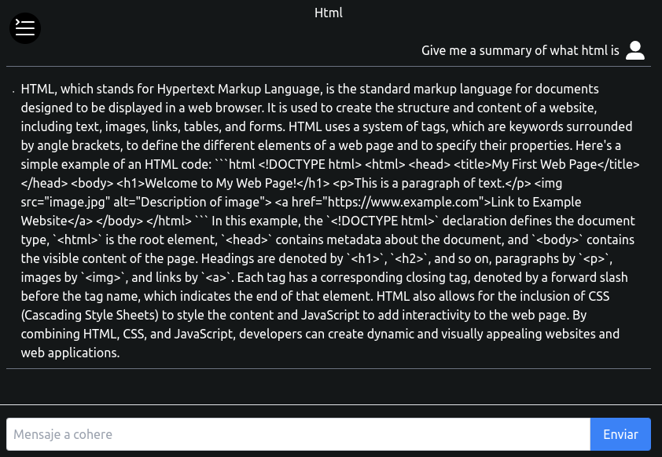

Este es un chatbot interactivo construido con React, que utiliza la [API de Cohere](https://cohere.com/) para generar respuestas inteligentes. El proyecto también incorpora Tailwind CSS y utiliza `sessionStorage` para mantener un historial de chats entre sesiones.

## Funcionalidades

- **Generación de respuestas:** Utiliza la API de Cohere para responder a las entradas del usuario.
- **Historial de chats:** El historial de conversaciones se guarda en `sessionStorage`, permitiendo que las sesiones anteriores se mantengan.
- **Añadir y eliminar chats:** Los usuarios pueden añadir nuevas conversaciones y eliminar las existentes.
- **Diseño moderno:** Utiliza Tailwind CSS para un estilo limpio y responsive.

[Web](https://chat-cohere-ai-react.vercel.app/) 

